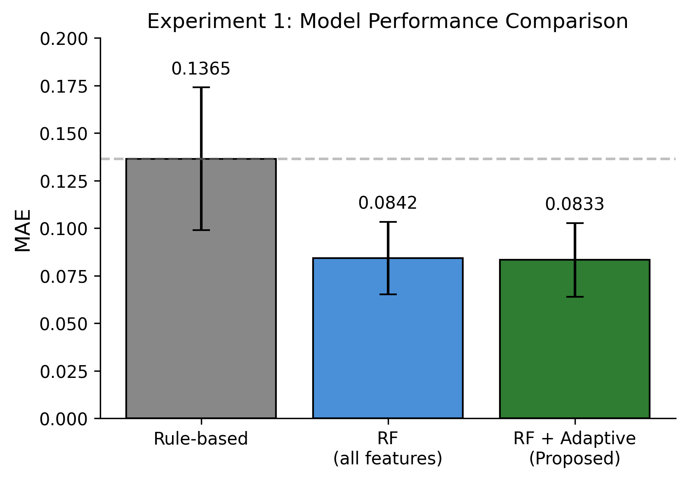
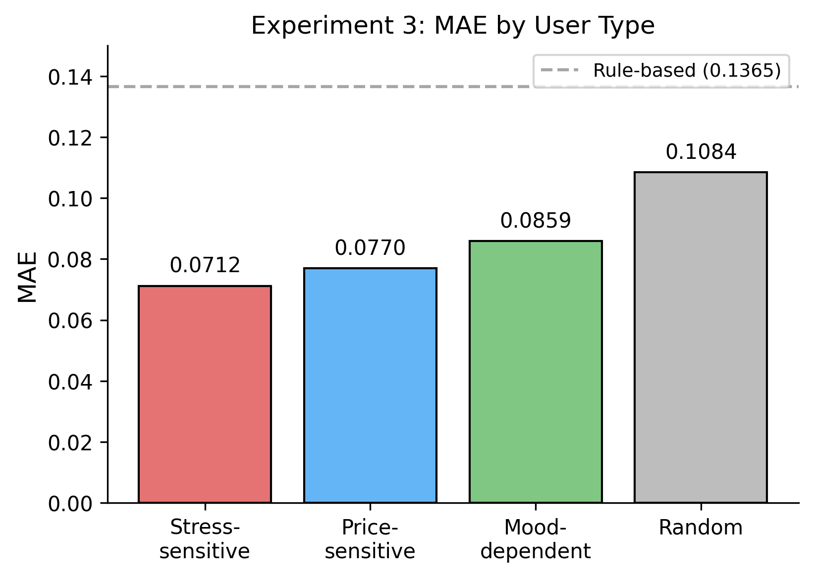
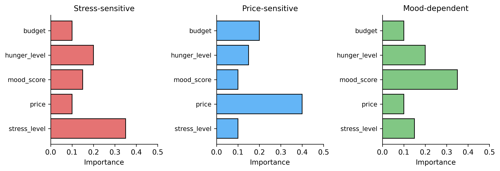

# 適応的特徴量選択による日常的意思決定の個人化後悔予測モデル

乾 映之右†　石橋 直樹†

† 武蔵野大学データサイエンス学部 〒135-0063 東京都江東区有明3丁目3-3

E-mail: †s2322007@stu.musashino-u.ac.jp, n-ishi@musashino-u.ac.jp

---

## あらまし

後悔は「選ばなかった選択肢」との比較による反実仮想的思考から生じる。従来の後悔理論研究は投資・医療など大規模な意思決定を対象としており、日常の小さな意思決定における予測的支援は十分に研究されていない。本研究では、SHAP値による適応的特徴量選択を用いて、ユーザーごとに異なる後悔要因を抽出する個人化予測モデルを提案する。提案手法は、データ量に応じてルールベースと機械学習を切り替えるハイブリッドアーキテクチャを採用する。仮想ユーザーを用いた実験の結果、提案手法はルールベース手法と比較してMAEが39%低く、ユーザー間で平均23%の特徴量が異なることを確認した。

**キーワード**: 機械学習、SHAP、意思決定支援、個人化、特徴量選択

---

## 1. はじめに

### 1.1 背景

日常生活において、我々は多くの小さな意思決定を行う。ランチで何を食べるか、衝動買いをするべきか、SNSを見続けるべきか。これらの決定は一つ一つは小さいが、繰り返されることで生活の質に影響する。疲労やストレスにより判断力が低下している時、後悔する選択をすることがある。

後悔理論に関する既存研究[1][2]は、主に投資判断、医療選択、キャリア決定など大規模な意思決定を対象としてきた。日常の小さな意思決定は頻度が高いにもかかわらず、研究対象として扱われることが少ない。また、Decision Journalなどの既存ツール[3]は事後の振り返りを支援するものであり、意思決定時点での予測的支援は提供していない。

### 1.2 研究課題

日常的意思決定における後悔予測には、以下の課題がある：

1. **個人差の存在**: 後悔を引き起こす要因は個人により異なる。ストレスに敏感な人もいれば、価格に敏感な人もいる。
2. **データ量の制約**: 個人のデータは限られており、大量データを前提とする手法は適用が難しい。
3. **解釈可能性の要求**: ユーザーが予測結果を受け入れるには、なぜその予測になったかの説明が必要である。

本研究では、「個人ごとに異なる後悔要因をどのように抽出し、少量データで予測するか」を研究課題とする。

### 1.3 本研究の貢献

本研究の貢献は以下の3点である：

1. SHAP値を用いてユーザーごとに特徴量を選択し、個人の後悔パターンを抽出する手法の提案
2. データ量に応じてルールベースと機械学習を切り替えるハイブリッド予測アーキテクチャの設計
3. 仮想ユーザー実験による、個人化の効果と適用可能なユーザータイプの調査

---

## 2. 関連研究

### 2.1 後悔理論

後悔は意思決定研究において重要な概念である。Zeelenbergら[1]は、後悔が「選ばなかった選択肢」との比較で生じることを示した。後悔は単なる失望とは異なり、「別の選択をしていれば」という反実仮想的な思考を伴う。

KahnemanとTversky[2]のプロスペクト理論は、人間が利得よりも損失に敏感であること（損失回避バイアス）を説明している。この理論は、なぜ人々が後悔を避けようとするのかを説明する。

これらの研究は主に大規模な意思決定を対象としている。日常の小さな意思決定に後悔理論を適用し、個人の後悔パターンを機械学習で捉える研究は少ない。

### 2.2 特徴量選択と解釈可能性

特徴量選択は、予測に関連する特徴量を選び出す手法である。フィルタ法、ラッパー法、埋め込み法などがある[4]。

SHAP（SHapley Additive exPlanations）[5]は、ゲーム理論のShapley値に基づき、各特徴量の予測への貢献度を算出する手法である。モデルの種類に依存せず解釈可能性を提供できる。TreeExplainerを用いることで、決定木ベースのモデルに対して効率的にSHAP値を計算できる。

本研究では、SHAPを特徴量の重要度評価に用い、ユーザーごとに異なる特徴量セットを選択することで個人化を行う。

### 2.3 個人化と少量データ学習

個人化機械学習では、ユーザーごとにモデルを適応させる。Few-shot learning[6]やメタ学習[7]は、少数サンプルからの学習手法として研究されている。しかし、これらは複雑なモデル構造を必要とすることが多く、解釈可能性が低くなる傾向がある。

推薦システム[8]はユーザーの好みを予測する技術であるが、「何を好むか」という正の側面を扱う。「何を後悔するか」という負の側面を予測する研究は少ない。

本研究は特徴量選択による個人化を採用する。全ユーザーで同じモデル構造を使いつつ、使用する特徴量をユーザーごとに変えることで、解釈可能性を保ちながら個人化を行う。

---

## 3. 提案手法

### 3.1 問題設定

ユーザー $u$ の意思決定 $d$ に対し、特徴量ベクトル $\mathbf{x}_d$ から後悔スコア $r_d \in [0,1]$ を予測する。後悔スコアは、ユーザーが事後に報告する後悔度（1-5の5段階）を0-1に正規化したものである。

目標は、ユーザーごとに予測関数 $f_u$ を学習することである。$f_u$ は、そのユーザーにとって重要な特徴量に基づいて予測を行う。

### 3.2 ハイブリッド予測アーキテクチャ

提案手法は、データ量に応じて予測手法を切り替える（図1）。

```
[ユーザー入力] → [特徴量抽出] → [データ量判定]
                                    |
                    +---------------+---------------+
                    |                               |
              [< 閾値]                         [≧ 閾値]
                    |                               |
            [ルールベース予測]              [SHAP特徴量選択]
                    |                               |
                    |                       [Random Forest予測]
                    |                               |
                    +---------------+---------------+
                                    |
                        [後悔スコア + 説明出力]
                                    |
                        [フィードバック収集] → [モデル更新]
```
**図1: ハイブリッド予測アーキテクチャ**

**ルールベース予測**: フィードバック数が閾値（本実験では10件）未満の場合に使用する。後悔理論に基づく手動設計ルールで予測を行う。例えば、ストレスレベルが高い場合、価格が高い場合、過去の同カテゴリでの後悔率が高い場合などに、後悔スコアを加算する。各要因の重みは先行研究[1][2]を参考に設定した。

**機械学習予測**: 閾値以上のデータが蓄積された場合に使用する。Random Forestで予測を行い、適応的特徴量選択により個人化する。

この切り替えにより、データが少ない初期段階でも予測を提供しつつ、データ蓄積後は個人化された予測に移行できる。

### 3.3 適応的特徴量選択

ユーザーごとに重要な特徴量を選択するため、SHAP値を用いる。手順は以下の通りである：

**手順1**: ユーザー $u$ の訓練データ $(X_u, y_u)$ でRandom Forestモデルを訓練する。

**手順2**: TreeExplainerを用いて、各サンプルの各特徴量についてSHAP値を計算する。

**手順3**: 特徴量 $j$ の重要度 $I_j$ を、SHAP値の絶対値の平均として算出する。
$$I_j = \frac{1}{n} \sum_{i=1}^{n} |\text{SHAP}_{ij}|$$

**手順4**: 重要度上位 $k$ 個の特徴量を選択する。本実験では $k=12$ とした。

**手順5**: 選択された特徴量のみを用いてモデルを再訓練する。

この手順により、ユーザーごとに異なる特徴量セットが選択される。例えば、ストレスに敏感なユーザーでは`stress_level`が上位に、価格に敏感なユーザーでは`price`が上位に選択されることが期待される。

### 3.4 説明の生成

予測結果とともに、以下の説明を生成する：

1. **後悔スコア**: 0-1の範囲で後悔の可能性を数値化する。0に近いほど後悔の可能性が低い。

2. **警告メッセージ**: 後悔リスクが高い場合、その要因を説明するメッセージを生成する。ユーザーの過去データから、「ストレスレベルが高い時に後悔した回数」などを集計し、メッセージに含める。

3. **類似ケース**: 過去の類似した意思決定とその結果を表示する。同じカテゴリで後悔度が高かった決定を検索し、参考情報として提示する。

---

## 4. 実験

### 4.1 実験設定

#### 4.1.1 仮想ユーザーの生成

実験では、心理学的に妥当な4タイプの仮想ユーザーを生成した。仮想ユーザーを用いる理由は、各タイプの後悔パターンを制御でき、提案手法がそのパターンを捉えられるかを検証できるためである。

- **ストレス敏感型（30%）**: ストレスレベルが4以上の時に後悔率が上昇する。
- **価格敏感型（30%）**: 価格が1000円以上の時に後悔率が上昇する。
- **気分依存型（20%）**: 気分スコアが低い時に後悔率が上昇する。
- **ランダム型（20%）**: 特定のパターンを持たず、後悔がランダムに発生する。

各ユーザーは、カテゴリ（食事、買い物、娯楽、学習、仕事）、コンテキスト（時刻、曜日、気分、ストレス、空腹度、天気、同伴者有無、予算残高）、決定要因（価格、期待度、健康価値、所要時間）をランダムに生成し、タイプに応じた後悔スコアを付与した。

#### 4.1.2 特徴量

本実験では18次元の特徴量を使用した：

- 決定要因（4次元）: price, taste_expectation, health_value, time_required
- コンテキスト（10次元）: mood_score, stress_level, hunger_level, hour_of_day, is_lunch_time, is_dinner_time, day_of_week, weather_encoded, with_others, budget_remaining
- 履歴特徴（4次元）: user_average_regret_this_category, user_regret_variance, similar_past_decisions_count, recent_regret_trend

履歴特徴は、その決定より前のデータのみを用いて計算した。

#### 4.1.3 評価指標

- **MAE（Mean Absolute Error）**: 予測スコアと実際の後悔スコアの差の絶対値の平均。
- **Jaccard距離**: ユーザー間で選択された特徴量セットの差異を測る。2つの集合 $A$, $B$ に対し、$1 - |A \cap B| / |A \cup B|$ で計算する。

#### 4.1.4 実験環境

Random Forestのパラメータは n_estimators=50, max_depth=10 とした。適応的特徴量選択では上位12特徴量を選択した。データ分割は時系列順を維持し、各ユーザーについて前半80件を訓練、後半20件をテストに用いた。

### 4.2 実験1: モデル性能の比較

**目的**: 提案手法とルールベース手法の予測性能を比較する。

**設定**: 100ユーザー × 100決定 = 10,000決定

**比較手法**:
1. ルールベースのみ: 後悔理論に基づく手動ルール
2. Random Forest（全18特徴量）: 特徴量選択なし
3. Random Forest + 適応的特徴量選択（提案手法）: ユーザーごとに上位12特徴量を選択

**結果**:

**表1: 実験1 モデル性能比較**

| 手法 | MAE | 標準偏差 |
|------|-----|----------|
| ルールベース | 0.1365 | 0.0375 |
| RF（全18特徴量） | 0.0842 | 0.0191 |
| RF + 適応的選択 | 0.0833 | 0.0193 |

提案手法のMAEは0.0833であり、ルールベース（0.1365）と比較して39%低かった（図3）。全特徴量RF（0.0842）との差は小さいが、t検定の結果、有意差があった（t=3.14, p=0.0022）。


**図3: 実験1 モデル性能比較**

### 4.3 実験2: 適応的特徴量選択の効果

**目的**: ユーザーごとに異なる特徴量が選択されるかを確認する。

**設定**: 50ユーザー × 100決定 = 5,000決定

**比較手法**:
1. 全18特徴量使用
2. 固定上位12特徴量: 全ユーザーの平均で重要度が高い12特徴量を使用
3. 適応的12特徴量（提案手法）: ユーザーごとにSHAP値で上位12特徴量を選択

**結果**:

**表2: 実験2 特徴量選択の効果**

| 手法 | MAE |
|------|-----|
| 全18特徴量 | 0.0860 |
| 固定12特徴量 | 0.0853 |
| 適応的12特徴量 | 0.0857 |

3手法のMAEの差は小さく、予測性能の観点では大きな違いはなかった。

特徴量選択の個人差を調べたところ、平均Jaccard距離は0.2330であった。これは、ユーザー間で平均して約23%の特徴量が異なることを意味する。また、50ユーザー中27ユーザー（54%）が他と異なる特徴量セットを持っていた。

ユーザータイプ別に見ると、ストレス敏感型では15人中15人が`stress_level`を選択し、価格敏感型では15人中15人が`price`を選択していた。気分依存型では10人中10人が`mood_score`を選択していた。これは、適応的特徴量選択がユーザータイプに応じた特徴量を選択できていることを示す。

### 4.4 実験3: ユーザータイプ別の予測精度

**目的**: 提案手法がどのユーザータイプに適用可能かを調べる。

**設定**: 100ユーザー（ストレス敏感型30名、価格敏感型30名、気分依存型20名、ランダム型20名）× 100決定

**結果**:

**表3: 実験3 ユーザータイプ別精度**

| ユーザータイプ | MAE | 備考 |
|--------------|-----|------|
| ストレス敏感型 | 0.0712 | パターンが単純で捉えやすい |
| 価格敏感型 | 0.0770 | 安定した予測 |
| 気分依存型 | 0.0859 | 中程度 |
| ランダム型 | 0.1084 | パターンがないため予測が難しい |

パターンが明確なストレス敏感型と価格敏感型ではMAEが0.07-0.08と低く、予測がうまくいっていた（図4）。ランダム型ではMAEが0.1084とやや高いが、ルールベース（0.1365）よりは低かった。


**図4: 実験3 ユーザータイプ別MAE**

### 4.5 実験4: 時系列モデルとの比較

**目的**: 深層学習の時系列モデル（LSTM）と比較する。

**設定**: 30ユーザー × 200決定、シーケンス長10

**結果**:

**表4: 実験4 時系列モデル比較**

| 手法 | MAE |
|------|-----|
| Random Forest | 0.0782 |
| LSTM | 0.1443 |
| Simple RNN | 0.1633 |

Random ForestのMAEが最も低く、LSTMはRandom Forestより悪い結果となった。

この結果の原因として、以下が考えられる：
1. データ量（200件/ユーザー）がLSTMの学習に十分でない
2. 手動設計した履歴特徴（recent_regret_trendなど）が時系列パターンを既に捉えている
3. LSTMが過学習している

少量データの状況では、適切な特徴量設計とシンプルなモデルの組み合わせが有効であった。

### 4.6 考察

**個人化の効果について**: 実験2で、ユーザー間で平均23%の特徴量が異なることを確認した。また、ユーザータイプに応じた特徴量（ストレス敏感型ならstress_level、価格敏感型ならprice）が選択されていた（図5）。これは、後悔要因が個人により異なり、適応的特徴量選択がその違いを捉えられることを示している。


**図5: ユーザータイプ別の特徴量重要度**

一方、予測性能（MAE）の観点では、適応的特徴量選択と固定特徴量選択の差は小さかった。これは、仮想ユーザーのパターンが比較的単純であり、18特徴量のうち多くが共通して有用だったためと考えられる。実際のユーザーではより個人差が大きい可能性がある。

**ユーザータイプによる適用可能性**: 実験3で、パターンが明確なユーザータイプ（ストレス敏感型、価格敏感型）では高い予測精度を達成した。ランダム型でもルールベースよりは良い結果であり、パターンの有無に関わらず適用可能であることを示唆する。

**深層学習との比較**: 実験4で、200件程度のデータではLSTMよりRandom Forestが良い結果を示した。日常的意思決定のデータは個人ごとに限られるため、少量データで動作する手法が必要である。本研究の特徴量設計とRandom Forestの組み合わせは、この要件を満たしている。

### 4.7 制限

本実験には以下の制限がある：

1. 仮想ユーザーを用いており、実際のユーザーでの検証が必要である
2. 仮想ユーザーのパターンは比較的単純であり、実際の後悔パターンはより複雑な可能性がある
3. 介入効果（予測を見せることで後悔が減るか）は検証していない

---

## 5. システム実装

提案モデルの実用性を確認するため、Webアプリケーションとして実装した。

システムは3層構造で構成される（図2）。プレゼンテーション層はJinja2テンプレートによるHTML生成を担当し、ユーザーはWebブラウザからアクセスする。アプリケーション層はFlask（Python）によるリクエスト処理を担当し、意思決定の記録、予測の実行、フィードバックの保存を行う。データ層はPostgreSQLに意思決定データ、フィードバック、後悔パターンを保存する。学習済みモデルはユーザーごとにファイル（.pkl）として保存する。

```
[ユーザー] ← HTTP → [Webサーバー (Flask)] ← SQL → [PostgreSQL]
                            ↓
                    [MLエンジン (scikit-learn)]
                            ↓
                    [モデルファイル (.pkl)]
```
**図2: システム構成**

データベースには主要なテーブルを3つ設けた。decisionsテーブルは意思決定を記録し、id、user_id、category、decision_text、alternatives（JSON）、context（JSON）、decision_factors（JSON）、predicted_regret_score、created_atを持つ。feedbacksテーブルはフィードバックを記録し、id、decision_id、regret_score、satisfaction_score、regret_reasons（JSON）、would_change、feedback_timing、created_atを持つ。regret_patternsテーブルは検出された後悔パターンを記録し、user_id、pattern_type、average_regret、occurrence_countを持つ。contextとdecision_factorsはJSON型で保存し、特徴量の追加・変更に対応できるようにした。

システムは3つの画面を提供する。意思決定記録画面では、ユーザーがカテゴリ（食事、買い物、娯楽、学習、仕事）をドロップダウンから選択し、決定内容をテキストで入力する。コンテキスト情報（気分、ストレス、空腹度）は1-5のスライダーで入力し、決定要因（価格、期待度、健康価値）も同様に入力する。入力後、予測ボタンを押すと後悔スコアと警告メッセージが表示される。フィードバック画面では、意思決定後に後悔度（1-5）と満足度（1-5）をスライダーで入力し、後悔理由を選択肢から選ぶ。フィードバックのタイミング（1時間後、1日後、1週間後など）も記録する。ダッシュボード画面では、総意思決定数、総フィードバック数、カテゴリ別の平均後悔度、検出された後悔パターン（上位3件）、週ごとの後悔度推移グラフを表示する。

意思決定記録時の処理フローは以下の通りである。ユーザーがフォームに入力し送信すると、サーバーがユーザーの過去の意思決定とフィードバックをデータベースから取得する。次に特徴量を抽出し（コンテキスト、決定要因、履歴特徴）、フィードバック数が閾値未満ならルールベース、閾値以上ならRandom Forestで予測する。予測結果と警告メッセージをユーザーに返し、意思決定をデータベースに保存する。フィードバック記録時は、フィードバックを保存した後、後悔パターンの再分析を行う。パターン分析では、高ストレス時の後悔、高額購入時の後悔、低期待値選択時の後悔などを検出し、2回以上発生したパターンをregret_patternsテーブルに保存する。

モデルの更新は、フィードバック数が閾値（10件）に達した時点で初回の訓練を行う。その後は、新しいフィードバックが記録されるたびにモデルを再訓練する。訓練済みモデルはユーザーIDをファイル名に含めて保存し、予測時に読み込む。モデルファイルが存在しない場合や読み込みに失敗した場合は、ルールベース予測にフォールバックする。これにより、システムの可用性を維持している。

---

## 6. おわりに

本研究では、SHAP値による適応的特徴量選択を用いた個人化後悔予測モデルを提案した。

実験の結果、以下を確認した：
1. 提案手法はルールベースと比較してMAEが39%低かった
2. ユーザー間で平均23%の特徴量が異なり、ユーザータイプに応じた特徴量が選択された
3. パターンが明確なユーザータイプではMAE 0.07-0.08を達成した
4. 少量データではLSTMよりRandom Forestが良い結果を示した

今後の課題として、実ユーザーでの検証、介入効果（予測を見せることで後悔が減るか）の検証、より複雑な後悔パターンへの対応がある。

---

## 参考文献

[1] M. Zeelenberg, et al., "The experience of regret and disappointment," Cognition & Emotion, Vol. 12, No. 2, pp. 221-230, 1998.

[2] D. Kahneman and A. Tversky, "Prospect theory: An analysis of decision under risk," Econometrica, Vol. 47, No. 2, pp. 263-291, 1979.

[3] Clearer Thinking, "Decision Journal," https://www.clearerthinking.org/

[4] I. Guyon and A. Elisseeff, "An introduction to variable and feature selection," Journal of Machine Learning Research, Vol. 3, pp. 1157-1182, 2003.

[5] S. M. Lundberg and S. I. Lee, "A unified approach to interpreting model predictions," Proc. NeurIPS, 2017.

[6] O. Vinyals, et al., "Matching networks for one shot learning," Proc. NeurIPS, 2016.

[7] C. Finn, et al., "Model-agnostic meta-learning for fast adaptation," Proc. ICML, 2017.

[8] Y. Koren, et al., "Matrix factorization techniques for recommender systems," Computer, Vol. 42, No. 8, pp. 30-37, 2009.
